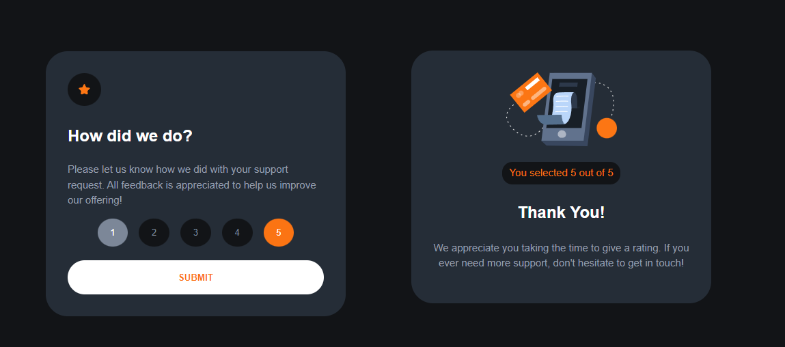

# Frontend Mentor - Interactive rating component solution

This is a solution to the [Interactive rating component challenge on Frontend Mentor](https://www.frontendmentor.io/challenges/interactive-rating-component-koxpeBUmI). Frontend Mentor challenges help you improve your coding skills by building realistic projects.

## Table of contents

- [Overview](#overview)
  - [The challenge](#the-challenge)
  - [Screenshot](#screenshot)
  - [Links](#links)
- [My process](#my-process)
  - [Built with](#built-with)
  - [What I learned](#what-i-learned)
- [Author](#author)

**Note: Delete this note and update the table of contents based on what sections you keep.**

## Overview

### The challenge

Users should be able to:

- View the optimal layout for the app depending on their device's screen size
- See hover states for all interactive elements on the page
- Select and submit a number rating
- See the "Thank you" card state after submitting a rating

### Screenshot



### Links

- Solution URL: [https://github.com/Helbindi/interactive-rating]()
- Live Site URL: [https://helbindi-interactive-rating.vercel.app/]()

## My process

### Built with

- [React](https://reactjs.org/) - JS library

### What I learned

This project was an exercise about the understanding of states and state management.

I used two states to keep track of the selected ratings and if the user has submitted, see below:

```html
const [rating, setRating] = useState(); const [submitted, setSubmitted] =
useState(false);
```

These states were then passed down the the child components:

```js
<RatingForm rating={rating} setRating={setRating} setSubmitted={setSubmitted} scores={scores} />
<Confirmation rating={rating} scores={scores} />
```

## Author

- Website - [Projects Site](https://my-projects-site.vercel.app)
- Frontend Mentor - [Helbindi](https://www.frontendmentor.io/profile/Helbindi)
